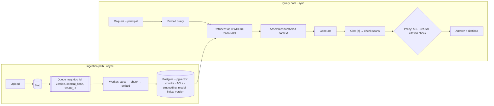

# Architecture — stages, contracts, failures

Reference for post 00 and every later post. Each post that changes a stage updates the relevant row here.

## 1. Two paths, one store

A RAG system is two pipelines that share a store:

- **Ingestion path (async).** Documents arrive, get parsed, chunked, embedded and written. Failures here are silent and delayed: nothing errors, but the evidence a future question needs is damaged or missing.
- **Query path (sync).** A principal asks a question; the system retrieves, assembles, generates and cites. Failures here are visible and immediate, which is why teams debug them first, often in the wrong place.

*Ingestion runs asynchronously behind a queue; queries run synchronously and pass a deterministic policy layer before returning. At `post-01` the policy layer enforces ACL only; refusal thresholds and citation validation arrive in post 07.*

Locally, Blob and Queue run on **Azurite** (the Azure Storage emulator) via docker-compose; the same code targets Azure Storage through a connection string. Azure deployment is added in post 21.

### Layer responsibilities

| Layer | Owns | Must not |
|---|---|---|
| Ingestion workers | parse, chunk, embed, transactional upsert per document version; idempotency by `(doc_id, content_hash)` | answer questions; decide access |
| Store (Postgres + pgvector) | chunks, vectors, ACLs, `embedding_model`, `index_version`, document versions | hold business rules beyond row-level access |
| Retrieval | ranked candidates **with access predicates inside the query** | filter by ACL after ranking |
| Generation | draft answer + citation markers from numbered context | decide whether an answer is allowed |
| Policy (deterministic) | ACL, refusal thresholds, citation validation | call a model |
| Eval / audit | span-level scoring, attribution, results keyed by config hash | modify pipeline state |

## 2. Stage contracts

Contracts are named here and implemented as typed models in `rag/contracts.py` from `post-01`.

| Contract | Emitted by | Key fields (indicative) |
|---|---|---|
| `Document` | parse | `doc_id`, `doc_version`, `tenant_id`, `acl_groups`, normalized text with page/char offsets, structure (headings, tables) |
| `Chunk` | chunk → embed | `chunk_id`, `doc_id`, `doc_version`, `char_start`, `char_end`, `text`, `embedding`, `embedding_model`, `index_version` |
| `RetrievedChunk` | retrieve | `chunk_id`, `score`, `rank`, retrieval method |
| `Answer` | generate → cite → policy | `text`, `citations[] → chunk_id + span`, `refused`, policy decisions |

Offsets on `Chunk` are what make the audit deterministic: a chunk can be checked against a gold span without a model.

## 3. Failure taxonomy

Every wrong answer is attributed to the **first** stage, in pipeline order, whose check fails.

| Stage | Consumes → emits | Characteristic failure | Detection signal | Fixed in |
|---|---|---|---|---|
| System | — | timeout, 5xx, queue lag | request/worker logs | 20, 22 |
| Parse | file → Document | tables flattened, reading order broken, OCR noise, headers dropped | gold span text absent from parsed text | 03, 16 |
| Chunk | Document → Chunk[] | answer split across chunks; lost referents ("the table above") | no chunk covers ≥ θ of the gold span | 04, 14 |
| Index | Chunk[] → vectors + metadata | embedding-model mismatch between index and query; stale or partial index | `embedding_model` / `index_version` mismatch | 05, 21 |
| Retrieve | query + principal → RetrievedChunk[] | evidence outside top-k; lexical miss on IDs and codes; ACL post-filter leak | no covering chunk in top-k | 06, 08–10 |
| Assemble | RetrievedChunk[] → prompt | truncated, badly ordered, buried mid-context | covering chunk retrieved but absent or truncated in the prompt | 07 |
| Generate | prompt → draft answer | unsupported claim; ignores context; answers when it should refuse | evidence in prompt, answer wrong or unsupported | 07, 13 |
| Cite | draft → Answer + citations | citation points to a chunk that doesn't support the claim | cited chunk doesn't cover the claim's gold span | 07, 19 |

`System` covers infrastructure failures only. Quality failures and system failures are reported separately.

### Relation to Barnett et al. (2024)

[Seven Failure Points When Engineering a RAG System](https://arxiv.org/abs/2401.05856) is the published anchor. Its points map onto the stages above:

| Barnett failure point | Stage here |
|---|---|
| FP1 Missing Content | corpus gap → Generate (should refuse) |
| FP2 Missed the Top Ranked Documents | Retrieve |
| FP3 Not in Context (consolidation) | Assemble |
| FP4 Not Extracted | Generate |
| FP5 Wrong Format | Generate |
| FP6 Incorrect Specificity | Generate |
| FP7 Incomplete | Generate |

Barnett's points start at retrieval. This taxonomy adds the ingestion-side stages (parse, chunk, index), citation, and system failures. FP4–FP7 are kept as optional sub-labels of Generate so audit results stay comparable with the paper.

## 4. Security surface by stage

Mapped to the [OWASP Top 10 for LLM Applications 2025](https://genai.owasp.org/llm-top-10/). Full threat model in post 19.

| Stage | Threat | OWASP 2025 | Deep dive |
|---|---|---|---|
| Ingest | injected or poisoned documents | LLM01 (indirect), LLM04 | 03, 19 |
| Index | cross-tenant vectors, embedding inversion | LLM08 | 19 |
| Retrieve | ACL applied after ranking → leakage | LLM08, LLM02 | 01, 10, 19 |
| Assemble / Generate | instructions inside retrieved text | LLM01 | 07, 19 |
| Cite / output | restricted spans or unsupported claims in the answer | LLM02, LLM05, LLM09 | 07, 19 |

Two rules hold from `post-01` onward: documents are untrusted input, and access control is enforced inside the retrieval query, never after it.

## 5. When not to build RAG

Qualitative; the long-context crossover is measured in post 13.

| Criterion | RAG | Long context | Fine-tuning | Hybrid |
|---|---|---|---|---|
| Freshness | re-ingest a document | fresh per request | stale until retrained | RAG for facts, FT for behaviour |
| Corpus size | scales with index | bounded by window and cost | n/a (not a lookup) | — |
| Citations | per chunk / span | possible, coarse | none | via RAG |
| Per-user access control | pre-filter per chunk | must build per-principal context | none — knowledge shared by all users | via RAG |
| Cost / latency shape | retrieval overhead, small prompts | grows with context length | training upfront, cheap inference | sum of parts |
| Changes format/style | weak | weak | strong | via FT |

Long-context answer quality depends on where evidence sits in the context ([Liu et al. 2023](https://arxiv.org/abs/2307.03172)). Questions over purely structured data are usually better answered with SQL.
